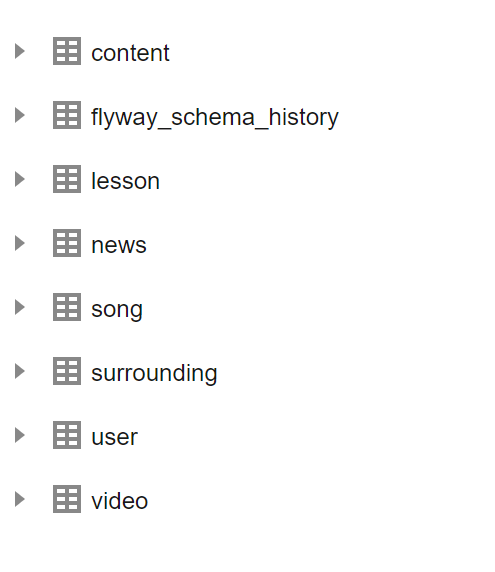

### 算法与数据结构

#### 4.1、数据库设计与实现

本项目开发中的数据库采用`InnoDB`引擎，字符集采用`utf8mb4`，排序规则采用`utf8mb4_bin`。

数据库的版本管理使用`Flyway`工具，在项目运行时自动执行项目目录`\src\main\resources\db\migration`下的sql文件，无需手动就可以实现数据库的创建和更改。

由于flyway工具是根据sql文件名称中字母`V`后数字大小顺序执行。所以执行的sql文件名称由写好的脚本（项目目录下`bin/migration.sh`）根据`时间戳+输入的名称`运行产生，方便集成，也省去了自己控制flyway执行顺序的过程。

以下为项目中各个数据库的设计：



- flyway_schema_history表

  该表为flyway工具自动生成的表，用于存储执行过的sql文件信息，确保每个sql文件只执行一次。

  ```sql
  DROP TABLE IF EXISTS `flyway_schema_history`;
  CREATE TABLE `flyway_schema_history` 
  	(
          `installed_rank` int NOT NULL,
          `version` varchar(50) CHARACTER SET utf8mb4 COLLATE utf8mb4_bin NULL DEFAULT NULL,
          `description` varchar(200) CHARACTER SET utf8mb4 COLLATE utf8mb4_bin NOT NULL,
          `type` varchar(20) CHARACTER SET utf8mb4 COLLATE utf8mb4_bin NOT NULL,
          `script` varchar(1000) CHARACTER SET utf8mb4 COLLATE utf8mb4_bin NOT NULL,
          `checksum` int NULL DEFAULT NULL,
          `installed_by` varchar(100) CHARACTER SET utf8mb4 COLLATE utf8mb4_bin NOT NULL,
          `installed_on` timestamp NOT NULL DEFAULT CURRENT_TIMESTAMP,
          `execution_time` int NOT NULL,
          `success` tinyint(1) NOT NULL,
          PRIMARY KEY (`installed_rank`) USING BTREE,
          INDEX `flyway_schema_history_s_idx`(`success` ASC) USING BTREE
  	) ENGINE = InnoDB CHARACTER SET = utf8mb4 COLLATE = utf8mb4_bin ROW_FORMAT = Dynamic;
  ```

  

- user表

  该表为管理端用户表，存储管理端账户信息。

  ```sql
  DROP TABLE IF EXISTS `user`;
  CREATE TABLE `user`  
  	(
          `username` varchar(64) CHARACTER SET utf8mb4 COLLATE utf8mb4_bin NOT NULL COMMENT '用户账号',
          `password` varchar(64) CHARACTER SET utf8mb4 COLLATE utf8mb4_bin NOT NULL COMMENT '用户密码',
          PRIMARY KEY (`username`) USING BTREE,
          INDEX `username`(`username` ASC) USING BTREE
  	) ENGINE = InnoDB CHARACTER SET = utf8mb4 COLLATE = utf8mb4_bin COMMENT = '用户表' ROW_FORMAT = Dynamic;
  ```

  

- news表

  该表为资讯表，用于存储资讯信息（即小程序中“普法”模块的资讯信息）。

  ```sql
  DROP TABLE IF EXISTS `news`;
  CREATE TABLE `news`  
  	(
          `id` varchar(32) CHARACTER SET utf8mb4 COLLATE utf8mb4_bin NOT NULL COMMENT '资讯id',
          `title` varchar(64) CHARACTER SET utf8mb4 COLLATE utf8mb4_bin NOT NULL COMMENT '资讯标题',
          `key_words` varchar(64) CHARACTER SET utf8mb4 COLLATE utf8mb4_bin NULL DEFAULT NULL COMMENT '资讯概要',
          `pic_url` varchar(255) CHARACTER SET utf8mb4 COLLATE utf8mb4_bin NOT NULL COMMENT '图片链接',
          `content` varchar(2048) CHARACTER SET utf8mb4 COLLATE utf8mb4_bin NOT NULL COMMENT '资讯内容',
          `creator_name` varchar(64) CHARACTER SET utf8mb4 COLLATE utf8mb4_bin NOT NULL COMMENT '发布人账号名称',
          `created_time` datetime(6) NOT NULL ON UPDATE CURRENT_TIMESTAMP(6) COMMENT '创建时间',
          `updated_time` datetime(6) NOT NULL ON UPDATE CURRENT_TIMESTAMP(6) COMMENT '更新时间',
          PRIMARY KEY (`id`) USING BTREE,
          INDEX `c_cloud_id`(`creator_name` ASC) USING BTREE
  	) ENGINE = InnoDB CHARACTER SET = utf8mb4 COLLATE = utf8mb4_bin COMMENT = '资讯表' ROW_FORMAT = DYNAMIC;
  ```

  

- video表

  该表为小视频表，存储小视频信息（即小程序中“发现”模块中的小视频）。

  ```sql
  DROP TABLE IF EXISTS `video`;
  CREATE TABLE `video`  
  	(
          `id` varchar(32) CHARACTER SET utf8mb4 COLLATE utf8mb4_bin NOT NULL COMMENT '视频id',
          `creator_name` varchar(64) CHARACTER SET utf8mb4 COLLATE utf8mb4_bin NOT NULL COMMENT '上传者昵称',
          `creator_pic_url` varchar(255) CHARACTER SET utf8mb4 COLLATE utf8mb4_bin NOT NULL COMMENT '上传者头像链接',
          `title` varchar(255) CHARACTER SET utf8mb4 COLLATE utf8mb4_bin NULL DEFAULT NULL COMMENT '标题',
          `video_url` varchar(255) CHARACTER SET utf8mb4 COLLATE utf8mb4_bin NOT NULL COMMENT '视频链接',
          `like_num` int UNSIGNED NOT NULL DEFAULT 0 COMMENT '点赞数',
          `created_time` datetime(6) NOT NULL ON UPDATE CURRENT_TIMESTAMP(6) COMMENT '上传时间',
          `updated_time` datetime(6) NOT NULL ON UPDATE CURRENT_TIMESTAMP(6) COMMENT '更新时间',
          PRIMARY KEY (`id`) USING BTREE
  	) ENGINE = InnoDB CHARACTER SET = utf8mb4 COLLATE = utf8mb4_bin ROW_FORMAT = DYNAMIC;
  ```

  

- song表

  该表为音乐表，存储音乐信息（即小程序中“音乐”模块中的音乐）。

  ```sql
  DROP TABLE IF EXISTS `song`;
  CREATE TABLE `song`  
  	(
          `id` varchar(32) CHARACTER SET utf8mb4 COLLATE utf8mb4_bin NOT NULL COMMENT '音乐id',
          `song_name` varchar(32) CHARACTER SET utf8mb4 COLLATE utf8mb4_bin NOT NULL COMMENT '歌曲名称',`singer_name` varchar(32) CHARACTER SET utf8mb4 COLLATE utf8mb4_bin NOT NULL COMMENT '歌手姓名',
          `song_url` varchar(255) CHARACTER SET utf8mb4 COLLATE utf8mb4_bin NOT NULL COMMENT '歌曲文件链接',
          `song_pic_url` varchar(255) CHARACTER SET utf8mb4 COLLATE utf8mb4_bin NOT NULL COMMENT '歌曲图片链接',
          `created_time` datetime(6) NOT NULL ON UPDATE CURRENT_TIMESTAMP(6) COMMENT '创建时间',
          `updated_time` datetime(6) NOT NULL ON UPDATE CURRENT_TIMESTAMP(6) COMMENT '更新时间',
          PRIMARY KEY (`id`) USING BTREE
  	) ENGINE = InnoDB CHARACTER SET = utf8mb4 COLLATE = utf8mb4_bin ROW_FORMAT = Dynamic;
  ```

  

- lesson表

  该表为课程表，储存课程的基本信息（即小程序中“课程”板块的基本信息）。

  ```sql
  DROP TABLE IF EXISTS `lesson`;
  CREATE TABLE `lesson`  
  	(
          `id` varchar(32) CHARACTER SET utf8mb4 COLLATE utf8mb4_bin NOT NULL COMMENT '课程id',
          `title` varchar(64) CHARACTER SET utf8mb4 COLLATE utf8mb4_bin NOT NULL COMMENT '课程名称',                         
          `classification` varchar(32) CHARACTER SET utf8mb4 COLLATE utf8mb4_bin NOT NULL COMMENT '课程分类',                           
          `teacher_name` varchar(64) CHARACTER SET utf8mb4 COLLATE utf8mb4_bin NOT NULL COMMENT '主讲人名称',                           
          `key_words` varchar(255) CHARACTER SET utf8mb4 COLLATE utf8mb4_bin NULL DEFAULT NULL COMMENT '课程介绍',                       
          `pic_url` varchar(255) CHARACTER SET utf8mb4 COLLATE utf8mb4_bin NOT NULL COMMENT '课程封面图片链接',
          `checked` tinyint(1) NOT NULL DEFAULT 0 COMMENT '是否审核通过，1-是，2-否',
          `created_time` datetime(6) NOT NULL ON UPDATE CURRENT_TIMESTAMP(6) COMMENT '上传时间',
          `updated_time` datetime(6) NOT NULL ON UPDATE CURRENT_TIMESTAMP(6) COMMENT '更新时间',
          PRIMARY KEY (`id`) USING BTREE
  	) ENGINE = InnoDB CHARACTER SET = utf8mb4 COLLATE = utf8mb4_bin ROW_FORMAT = DYNAMIC;
  ```

  

- surrounding表

  该表为周围表，储存周围的基本信息（即小程序中“周围”模块的基本信息）。

  ```sql
  DROP TABLE IF EXISTS `surrounding`;
  CREATE TABLE `surrounding`  
  	(
          `id` varchar(32) CHARACTER SET utf8mb4 COLLATE utf8mb4_bin NOT NULL COMMENT '周围id',                               
          `creator_name` varchar(64) CHARACTER SET utf8mb4 COLLATE utf8mb4_bin NOT NULL COMMENT '上传者昵称',                           
          `creator_pic_url` varchar(255) CHARACTER SET utf8mb4 COLLATE utf8mb4_bin NOT NULL COMMENT '上传者头像链接',                   
          `title` varchar(255) CHARACTER SET utf8mb4 COLLATE utf8mb4_bin NOT NULL COMMENT '标题',                            
          `created_time` datetime(6) NOT NULL ON UPDATE CURRENT_TIMESTAMP(6) COMMENT '上传时间',                           
          `updated_time` datetime(6) NOT NULL ON UPDATE CURRENT_TIMESTAMP(6) COMMENT '更新时间',                           
          PRIMARY KEY (`id`) USING BTREE
  	) ENGINE = InnoDB CHARACTER SET = utf8mb4 COLLATE = utf8mb4_bin ROW_FORMAT = Dynamic;
  ```

  

- content表

  该表为内容表，储存课程和周边中的文件信息。

  ```sql
  DROP TABLE IF EXISTS `content`;
  CREATE TABLE `content`  
  	(  
          `id` varchar(36) CHARACTER SET utf8mb4 COLLATE utf8mb4_bin NOT NULL COMMENT '内容id',  
          `lesson_id` varchar(36) CHARACTER SET utf8mb4 COLLATE utf8mb4_bin NOT NULL COMMENT '所属课程或周边id',  
          `content_url` varchar(255) CHARACTER SET utf8mb4 COLLATE utf8mb4_bin NOT NULL COMMENT '内容链接', 
          `created_time` datetime(6) NOT NULL ON UPDATE CURRENT_TIMESTAMP(6) COMMENT '创建时间',  
          `updated_time` datetime(6) NOT NULL ON UPDATE CURRENT_TIMESTAMP(6) COMMENT '更新时间',  
          PRIMARY KEY (`id`) USING BTREE
  	) ENGINE = InnoDB CHARACTER SET = utf8mb4 COLLATE = utf8mb4_bin ROW_FORMAT = DYNAMIC;
  ```

#### 4.2、后端服务层次设计与实现要点

服务与部署项目代码目录

```
├─.idea
│  ├─dataSources
│  ├─inspectionProfiles
│  └─libraries
├─.mvn
│  └─wrapper
├─bin------------------------------储存自动生成sql文件的脚本文件migration.sh
├─src
│  ├─main
│  │  ├─java
│  │  │  └─com
│  │  │      └─miniapp
│  │  │          └─countryside-----主要代码文件
│  │  │              ├─controller
│  │  │              ├─dto
│  │  │              ├─entity
│  │  │              ├─exception
│  │  │              ├─handler
│  │  │              ├─mapper
│  │  │              ├─repository
│  │  │              ├─service
│  │  │              │  └─impl
│  │  │              ├─utils
│  │  │              └─vo
│  │  └─resources
│  │      └─db
│  │          └─migration
│  └─test
│      ├─java
│      │  └─com
│      │      └─miniapp
│      │          └─countryside
│      └─resources
└─target
  ├─classes
  ├─generated-sources
  ├─generated-test-sources
  └─test-classes
```


##### （1） 后端服务的层次设计

- entity层：数据层。维护持久层类，用于直接调取数据库

- vo层：数据层。作为服务接口的返回值

- dto层：数据层。作为前端调用接口时传输参数的储存与传输，并承担数据校验工作。

- controller层：接口层。定义服务的接口，调用service层方法，控制数据的传入与传出，输出为Vo层对象。

- service层：方法层。定义传入数据和数据库的处理方法，输入和输出数据均为Dto层对象。

- repository层：数据库方法层。定义数据库处理的方法，输出为Entity层对象。

- mapper层：对象转换层。定义对象转换的接口。

- exception层：异常类定义层。自定义异常类与异常类型。

- handler层：处理层。本项目实现了全局的异常捕捉与处理。定义了项目中可能遇到的异常类型（`RuntimeException`、`MethodArgumentNotValidException`、`AccessDeniedException`）的处理过程。

- utils层：工具层。本项目实现了数据库主键id的生成器。

  所以，数据的传输和处理过程如下图所示：

  

##### (2) 实现要点：

- Mapper层中运用MapStruct，实现Entity层、Dto层、Vo层对象间的相互转换。
- Entity层、Dto层、Vo层中使用`@Data`注解，自动生成setter和getter方法。
- controller层运用`@RequestBody`注解，实现把传输的json数据向对象映射的过程。
- dto层运用了Validate，实现传入数据的简单校验和报错
- handler层运用了`@ExceptionHandler`注解，实现全局异常的捕捉与处理
- utils层使用`Ksuid`工具，实现了主键字段id的生成器。
- repository层继承了`JpaRepository`类，具有很多现成的函数，方便对数据库进行处理。