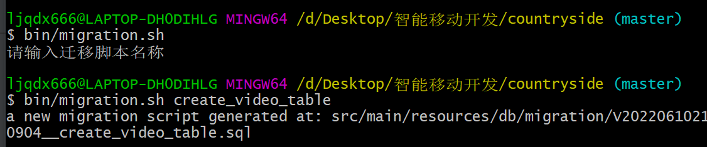

管理人

- 云id
- 账户
- 密码

老师

- 云id
- 账户
- 密码

资讯

- 标题
- 概要
- 图片
- 内容

课程

- 课程id
- 标题
- 主讲人
- 介绍
- 视频链接数组
- // 评价字典
- 群聊id
- 作业id数组

作业

- id
- 发布时间
- 截止时间
- 内容

课程群聊

- 群聊id
- 名称
- 学生数组

小视频

- 视频id
- 上传者昵称
- 上传者头像
- 标题
- 视频链接
- 点赞数

周围

- id
- 上传者昵称
- 上传者头像
- 文字内容
- 图片链接数组

音乐

- 歌名
- 歌手
- 文件链接

问答（这个再说）

- 老师id
- 学生id
- ……

flyway 数据库版本管理工具

entity 维护持久层类，调取数据库

vo 用于api（接口）返回值（所有人公开）

dto 接口传参数及传输，承担校验（部分人公开）

mapstruct类型转换器

component组件注入

service业务逻辑

controller调用service

requestbody将传入的json转为类对象

controller层校验交给dto（createdto）（前端校验）

service层业务校验，传入dto传出dto

Data自动写好setter和getter

